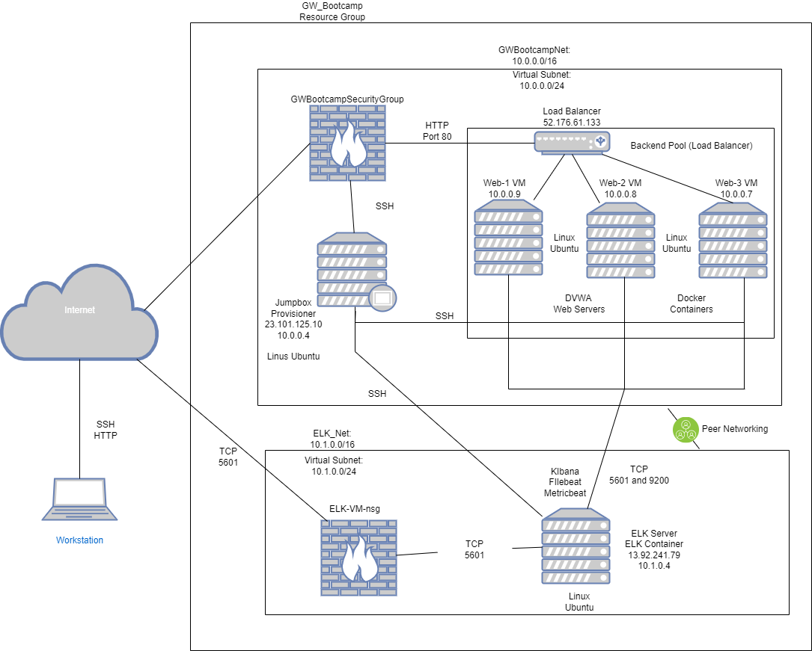

## Automated ELK Stack Deployment

The files in this repository were used to configure the network depicted below.

**Note**: The following image link needs to be updated. Replace `diagram_filename.png` with the name of your diagram image file.  

  

These files have been tested and used to generate a live ELK deployment on Azure. They can be used to either recreate the entire deployment pictured above. Alternatively, select portions of the ( Ansible ) file may be used to install only certain pieces of it, such as Filebeat.

  - Ansible._
**(Copy and paste the whole file)**
This document contains the following details:
- Description of the Topology
- Access Policies
- ELK Configuration
  - Beats in Use
  - Machines Being Monitored
- How to Use the Ansible Build

### Description of the Topology

The main purpose of this network is to expose a load-balanced and monitored instance of DVWA, the D*mn Vulnerable Web Application.

Load balancing ensures that the application will be highly applicable, in addition to restricting vulnerbility to the network.
-What aspect of security do load balancers protect? ( defends an organization against DDoS attacks. ) What is the advantage of a jump box? ( any tools in place for the SAN system are maintained on that single system.)

Integrating an ELK server allows users to easily monitor the vulnerable VMs for changes to the network and system configuration.
- What does Filebeat watch for? ( monitors the log files or locations that you specify, collects log events, and forwards them either to Elasticsearch or Logstash for indexing. )
-( What does Metricbeat record? Takes the metrics and statistics that it collects and ships them to the output that you specify. )

The configuration details of each machine may be found below.
_Note: Use the [Markdown Table Generator](http://www.tablesgenerator.com/markdown_tables) to add/remove values from the table_.

| Name     | Function                                           | IP Addresses            | OS                   |
|----------|----------------------------------------------------|-------------------------|----------------------|
| Jump_Box | Gateway                                            | 20.40.96.241  10.30.0.4 | Linux (ubuntu 18.04) |
| Web_1    | web Server Running DVWA                            | 20.89.49.23  10.3.0.5   | Linux                |
| Web_2    | Web Server Running DVWA                            | 20.89.49.23  10.3.0.6   | Linux                |
| Elk_VM   | Elk Container with Filebeat & Metricbeat to Kibana | 10.6.0.4                | Linux                |

### Access Policies

The machines on the internal network are not exposed to the public Internet. 

Only the Jump_Box machine can accept connections from the Internet. Access to this machine is only allowed from the following IP addresses:
- My Public IP address via SSH Port 22

Machines within the network can only be accessed by the Jump_Box inside of the specific Resource Group.
- Which machine did you allow to access your ELK VM? Jump_Box What was its IP address? 20.40.96.241

A summary of the access policies in place can be found in the table below.

| Name     | Publicly Accessible | Allowed IP Addresses |
|----------|---------------------|----------------------|
| Jump Box | Yes                 | 10.0.0.1 10.0.0.2    |
| Web 1    | Yes                 | 10.3.0.4 10.3.0.7    |
| Web 2    | Yes                 | 10.3.0.5 10.3.0.8    |

### Elk Configuration

Ansible was used to automate configuration of the ELK machine. No configuration was performed manually, which is advantageous because...
- What is the main advantage of automating configuration with Ansible? ( It runs once you start Ansible. )

The playbook implements the following tasks:
- Downloading Docker & Ansible
- Deploying both
- running Kibana through Elk VM

The following screenshot displays the result of running `docker ps` after successfully configuring the ELK instance.

**Note**: The following image link needs to be updated. Replace `docker_ps_output.png` with the name of your screenshot image file.  

### Target Machines & Beats
This ELK server is configured to monitor the following machines:
- Web 1 
- Web 2
- JumpBox

We have installed the following Beats on these machines:
- Filebeat
- Metricbeat

These Beats allow us to collect the following information from each machine:
- Filebeat: monitors the log files or locations that you specify, collects log events, and forwards them either to Elasticsearch or Logstash for indexing.
- Metricbeat: to periodically collect metrics from the operating system and from services running on the server.

### Using the Playbook
In order to use the playbook, you will need to have an Ansible control node already configured. Assuming you have such a control node provisioned: 

SSH into the control node and follow the steps below:
- Copy the myplaybook file to File.
- Update the myplaybook file to include...
- Run the playbook, and navigate to Kibana to check that the installation worked as expected.

_TODO: Answer the following questions to fill in the blanks:_
- Which file is the playbook? filebeat filebeat-playbook.yml Where do you copy it? In the File directory
- Which file do you update to make Ansible run the playbook on a specific machine? On the File directory we created. How do I specify which machine to install the ELK server on versus which to install Filebeat on? Filebeat is and can be installed on the Elk server or the JumpBox.
- Which URL do you navigate to in order to check that the ELK server is running? $smarts/bin/sm_service show

_As a **Bonus**, provide the specific commands the user will need to run to download the playbook, update the files, etc._
